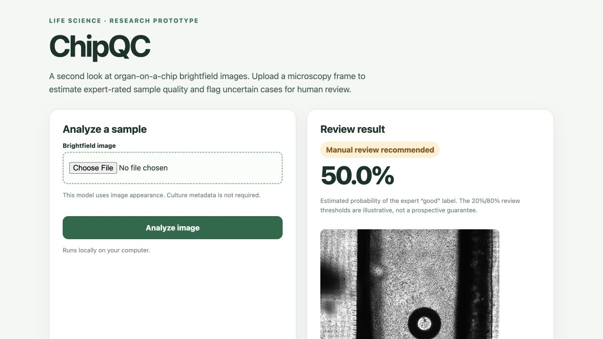

# ChipQC: batch-aware organ-on-a-chip image review

ChipQC is a research prototype for reviewing brightfield images of organ-on-a-chip cultures. It estimates the expert-assigned **good/bad sample-quality label** and recommends manual review when the estimate is uncertain. It is prepared for the AI4S Open Innovation challenge in the **Tool & Platform** category.

The contribution is an evaluation and review workflow designed around acquisition shifts: models are tested on imaging dates absent from their training folds, and those results are compared with ordinary image-random validation. The date is inferred from the first six characters of each image ID. It is a proxy for acquisition batch, **not** a verified chip or patient identifier.

## Data and rights

The source is Movčana et al., [Organ-on-a-Chip (OOC) Image Dataset](https://doi.org/10.5281/zenodo.10203721), Zenodo 2023, **CC BY 4.0**. It contains 3,072 brightfield images with expert good/bad labels, six cell types, culture age, and some flow and seeding metadata. The data come from cell-line experiments; this repository does not include the raw images or spreadsheet. The downloader retrieves images directly from Zenodo. Credit and a link to the license are required when reusing the dataset.

This project also builds on the published idea of image-embedding classification for chip quality; see [George and Kenry, 2025](https://pmc.ncbi.nlm.nih.gov/articles/PMC12745998/). Their reported random split is a motivation for testing a separate date-held-out protocol. Their code or model is not copied here.

## Measured results and demo

The selected frozen MobileNet + logistic regression model reached ROC AUC
**0.748** on acquisition dates excluded from training (date-bootstrap 95%
interval **0.694–0.797**), compared with **0.816** on random image folds.
These are retrospective validation results, not a Kaggle ranking or score.

[Watch the captioned 1:55 demonstration on YouTube](https://www.youtube.com/watch?v=a4K4RDLJSao) ([download MP4](demo/chipqc-demo.mp4)) or read the
[technical report](reports/TECHNICAL_REPORT.md). The recorded examples use a
checkpoint that excludes their acquisition dates.



## Reproduce

### Check the published metrics without downloading images

From this directory, run with Python's standard library only:

```bash
python3 -m src.verify_metrics --output reports/metrics-verification.json
```

This checks the frozen prediction and evaluation hashes and recomputes all five
date-held-out models' pooled metrics, the selected model's random-fold metrics,
illustrative score bands, and review-queue results. It reads no images or model
weights. The saved receipt takes about 0.05 seconds on the development machine;
this is metric verification, not a rerun of training or the bootstrap intervals.
See [the verification results](reports/METRICS_VERIFICATION.md).

With the Python 3.13 environment and source images cached as described below,
run `.venv/bin/python -m src.build_failure_gallery` to reproduce the
[four selected image-score disagreements](reports/failure_gallery.png).
The [gallery report](reports/FAILURE_GALLERY.md) and
[selection manifest](reports/failure_gallery_manifest.json) document the fixed
selection rule, source attribution and hash/probability checks; this command
reads saved predictions and performs no training or model inference.

### Recreate features, training and the local app

Use Python 3.13. From this directory:

```bash
python3 -m venv .venv
.venv/bin/python -m pip install -r requirements.txt
.venv/bin/python -m src.fetch_ooc --limit 0 --workers 8
.venv/bin/python -m src.features
.venv/bin/python -m src.embeddings
OPENBLAS_NUM_THREADS=1 OMP_NUM_THREADS=1 .venv/bin/python -m src.evaluate
.venv/bin/python -m src.plot_results
.venv/bin/python -m src.write_report
.venv/bin/uvicorn src.app:app --host 127.0.0.1 --port 8000
```

Open <http://127.0.0.1:8000> and upload a microscopy frame. The reported study uses all 3,072 images. For a smaller development run, `--limit 1200` selects images deterministically by image-ID hash. `data/selection.csv` controls the evaluation population even when more images are already cached. The archive is about 6.7 GB. The downloader uses HTTP ranges, verifies each downloaded ZIP member's CRC, and throttles requests to respect Zenodo's rate limit. It also downloads and checks the label spreadsheet. The pretrained MobileNetV3 Small weights are fetched from the official PyTorch model URL with TLS verification and a pinned full SHA-256 checksum.

## Files and outputs

- `src/fetch_ooc.py`: source manifest and selective image download.
- `src/features.py`: focus, brightness, edge, texture, and spatial-frequency descriptors.
- `src/embeddings.py`: frozen MobileNetV3 features from full and central views.
- `src/evaluate.py`: image-random and date-grouped five-fold comparisons, metrics, predictions, and final model.
- `src/shift.py`: exploratory image-appearance novelty screen.
- `src/plot_results.py` and `src/write_report.py`: generate evaluation figures and the technical report from measured outputs.
- `src/app.py`: local upload-and-review demo.
- `reports/evaluation.json`: generated metrics, including ROC AUC, balanced accuracy, and Brier score.
- `reports/TECHNICAL_REPORT.md`: measured results, data provenance, limitations, and references.

Read the [technical report](reports/TECHNICAL_REPORT.md) for the results and confidence intervals. The initial 1,200-image development outputs are retained separately in `reports/development_1200/`.

The source ZIP, images, cached features, and downloaded model weights are excluded from Git. The trained classifier and its image-feature reference points are saved in `models/chipqc.joblib`. Evaluation also saves `models/chipqc-demo-heldout.joblib` and `reports/demo_holdout_manifest.csv`; this checkpoint excludes the acquisition dates used in the recorded demo. To reproduce that demo, run:

```bash
CHIPQC_MODEL_PATH=models/chipqc-demo-heldout.joblib .venv/bin/uvicorn src.app:app --host 127.0.0.1 --port 8000
```

No Kaggle competition prediction CSV is required: this hackathon accepts a Kaggle Writeup with a demo video, public code, and technical report.

## Scope

The probability describes agreement with this dataset's expert image-quality label. It is not a measurement of tissue function, drug response, or clinical safety. The example review thresholds are illustrative. Acquisition-date grouping reduces one source of validation leakage but does not prove transfer to a new laboratory, instrument, donor, chip design, or cell type.
