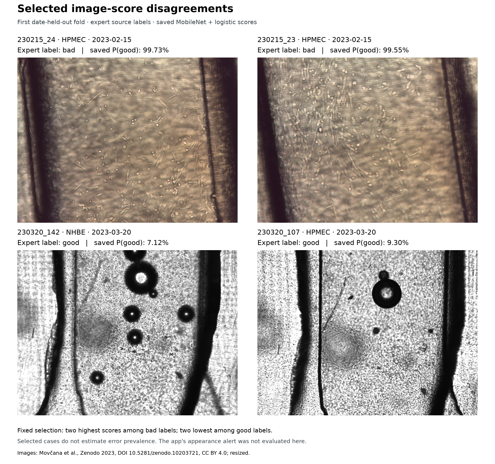

# Selected image-score disagreements



## Scope and selection

Restrict to the saved first date-held-out validation fold. Select two bad expert-label frames with the highest saved P(good) >=0.8, then two good expert-label frames with the lowest saved P(good) <=0.2. Break ties by imageID.

These are deliberately selected disagreements from one validation fold, not an
estimate of error prevalence. Two bad-label examples share acquisition date
230215. The labels are the source experts' visual quality judgments; image
appearance alone does not establish biological failure, label error, or a cause.
The saved image scores are not the combined application's decisions. Its
appearance alert was not evaluated for these cases. No new aggregate performance
metric, threshold calibration, workflow benefit, or time saving is claimed.

| Image ID | Expert label | Cell type | Acquisition date | Holdout P(good) | Grouped OOF P(good) |
|---|---|---|---|---:|---:|
| 230215_24 | bad | HPMEC | 2023-02-15 | 0.9973124 | 0.9973124265670776 |
| 230215_23 | bad | HPMEC | 2023-02-15 | 0.995452 | 0.9954519867897034 |
| 230320_142 | good | NHBE | 2023-03-20 | 0.071219586 | 0.07121958583593369 |
| 230320_107 | good | HPMEC | 2023-03-20 | 0.09295747 | 0.09295746684074402 |

## Reproduction and checks

From the repository directory, with the README's Python 3.13 environment and
source images already cached:

```bash
.venv/bin/python -m src.build_failure_gallery
```

The generator verifies frozen CSV hashes, deterministic four-ID selection,
metadata and probability agreement within 1e-7 for every held-out row, and the
four source images' hashes, labels, cell types, splits and byte counts. It reads
saved predictions and images only; it performs no fitting or model inference.
The first date-held-out fold is saved by `src/evaluate.py` in
`reports/demo_holdout_manifest.csv`. Source `train`/`test` archive folders are
metadata; they do not define this acquisition-date-held-out fold.

Exact inputs, CSV row numbers, raw probabilities, image properties and SHA-256
hashes are in [the manifest](failure_gallery_manifest.json). The PNG SHA-256 is
`fc334da992092a35b1683a82d035f9eadcea1963ba607518322c039981a05e2d`. The source images are shown full-frame with preserved aspect
ratio and source color/grayscale; display resizing is the only image transform.
The original cached PNG files remain unchanged. The existing aggregate metrics
and study outputs are unchanged.

## Attribution and rights

Images: Movčana et al., Zenodo 2023, DOI 10.5281/zenodo.10203721, CC BY 4.0; resized.

Source: [Organ-on-a-Chip (OOC) Image Dataset](https://doi.org/10.5281/zenodo.10203721),
Movčana et al., Zenodo, 2023. The figure's source image content remains under
[Creative Commons Attribution 4.0](https://creativecommons.org/licenses/by/4.0/); annotations and presentation
were added by the ChipQC project. Full creator attribution is retained in
[THIRD_PARTY_NOTICES.md](../THIRD_PARTY_NOTICES.md). This gallery does not add a
clinical or biological validation claim.
