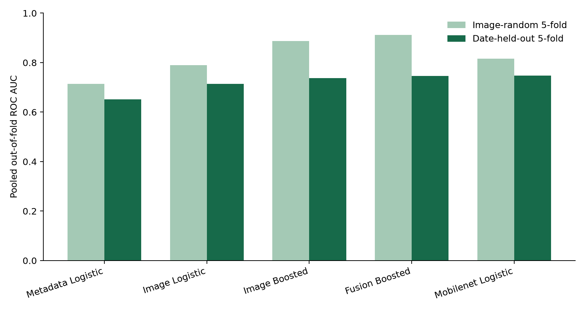
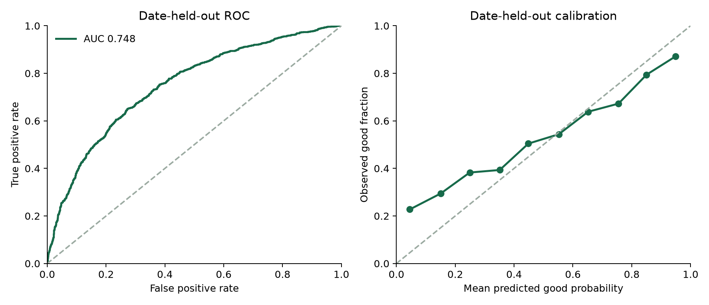

# ChipQC: batch-aware quality review for organ-on-a-chip microscopy

**AI4S category:** Tool & Platform. **Status:** research prototype; retrospective image-label validation only.

## Problem and proposed use

Organ-on-a-chip (OoC) experiments generate brightfield frames for visual review. ChipQC estimates whether a frame would receive the source dataset's expert *good* rather than *bad* image-quality label, and presents a manual-review prompt with simple image diagnostics. A scientist retains the decision. ChipQC does not measure drug efficacy, tissue function, or clinical safety.

## Data and provenance

We use **the complete 3,072-image collection** from [Movčana et al.'s OOC Image Dataset](https://doi.org/10.5281/zenodo.10203721) (CC BY 4.0). The study has **1727 good** and **1345 bad** labels, six cell types, and partial culture metadata. It spans **59** acquisition-date prefixes. Raw images and the metadata spreadsheet are fetched from the cited source and are not redistributed here. There are no patient images in this source dataset.

Image sizes (width × height; image count): 640x480: 87; 1536x2048: 3; 2048x1536: 934; 2056x1542: 2048. Missing metadata counts: seeding_density: 351; flow_ul_min: 859; time after seeding, h: 2244.

The supplied archive contains source train/validation/test folders. We combine them for a new five-fold study because the scientific question here is performance on unseen acquisition dates. The date prefix in `imageID` is a grouping proxy; chip identity and laboratory identity were unavailable. Repeated views of a chip across dates could still be related.

The labels summarize expert visual judgments of culture morphology, density, and artifacts; they are not measured biological function. George and Kenry (2025) previously used embeddings and classifiers on a differently selected and cropped subset of the same collection. Our protocols, cell coverage, and label tasks differ, so their scores are not directly comparable with ours.

## System and methods

The ingestion script reads the source ZIP by HTTP byte range and verifies archive/member sizes. Each frame is measured globally and in a central crop: brightness distribution, Laplacian focus proxy, gradient and edge content, texture co-occurrence, orientation, spatial-frequency energy, and image width and height. A second feature route uses a frozen ImageNet-pretrained MobileNetV3 Small encoder on the same two views, then PCA to 64 components and regularized logistic regression. We compare image logistic regression, histogram gradient boosting, a metadata-only logistic reference, and an image-plus-metadata boosted model. Missing numeric metadata is imputed within each training fold. No label information is used in feature extraction or outside-fold fitting.

We evaluate each candidate twice: five-fold stratified image-random validation and five-fold stratified **acquisition-date-held-out** validation. All frames from one date prefix remain in one fold. The grouped estimate is the primary result. We report pooled out-of-fold (OOF) ROC AUC, average precision (AP), balanced accuracy at 0.5, and Brier score. The confidence interval resamples acquisition dates, retaining all images within a sampled date. We select the image-dependent model with the highest grouped OOF ROC AUC, then refit it on the complete study dataset for the deployment prototype. The recorded demo uses a separate checkpoint fitted without its example dates. This model selection uses the same folds and may make its reported result optimistic; an independent laboratory test is still needed.

## Retrospective results

| Model | Random AUC | Date-held-out AUC | Date AP | Date balanced accuracy | Date Brier |
|---|---:|---:|---:|---:|---:|
| Metadata Logistic | 0.715 | 0.652 | 0.698 | 0.604 | 0.229 |
| Image Logistic | 0.789 | 0.715 | 0.733 | 0.670 | 0.214 |
| Image Boosted | 0.888 | 0.737 | 0.733 | 0.675 | 0.211 |
| Fusion Boosted | 0.912 | 0.746 | 0.769 | 0.675 | 0.210 |
| Mobilenet Logistic | 0.816 | 0.748 | 0.780 | 0.683 | 0.211 |

The selected model is **mobilenet logistic**. Its grouped AUC is **0.748** (date-bootstrap 95% interval **0.694–0.797**), versus **0.816** with image-random folds. Across these candidates, image-random scores are higher. The protocols use different fold assignments, and their score differences are not causal effect estimates.

For the selected model, random-minus-grouped AUC is **0.068**, with a paired acquisition-date-bootstrap 95% interval of **0.048–0.089**. This quantifies the observed protocol difference while keeping images from a date together during resampling.

At illustrative review thresholds of 0.2 and 0.8, **45.5%** of OOF images fall outside the manual-review band; balanced accuracy on that subset is **0.789**. This is a probability-only subset; appearance alerts can further increase review. These thresholds were not prospectively calibrated and must not be interpreted as guaranteed error bounds.

### Breakdown by cell type

| Cell type | Images | Good share | Date-held-out AUC | Balanced accuracy |
|---|---:|---:|---:|---:|
| A549 | 775 | 0.693 | 0.700 | 0.617 |
| CACO | 346 | 0.315 | 0.806 | 0.749 |
| HPMEC | 1462 | 0.546 | 0.747 | 0.685 |
| HSAEC | 244 | 0.668 | 0.690 | 0.645 |
| HUVEC | 107 | 0.140 | 0.998 | 0.973 |
| NHBE | 138 | 0.761 | 0.704 | 0.611 |

### Transfer to a held-out cell type

After choosing the model, we also refit it six times, each time excluding one entire cell type. These experiments test a different shift from the main date protocol; acquisition dates can overlap between training and validation here. They are exploratory and were not used to choose the model.

| Held-out cell type | Images | AUC | Balanced accuracy | Brier |
|---|---:|---:|---:|---:|
| A549 | 775 | 0.703 | 0.617 | 0.228 |
| CACO | 346 | 0.832 | 0.757 | 0.202 |
| HPMEC | 1462 | 0.717 | 0.643 | 0.241 |
| HSAEC | 244 | 0.652 | 0.649 | 0.220 |
| HUVEC | 107 | 0.996 | 0.995 | 0.061 |
| NHBE | 138 | 0.768 | 0.675 | 0.193 |

Small cell-type subgroups have unstable estimates. The application also compares a new image with training-image appearance in a 12-component handcrafted-feature space. Its 95th-percentile, other-date nearest-neighbor distance is an exploratory novelty flag. It is **not** a validated out-of-distribution or safety detector.

## Reproducibility and use

The [README](../README.md) gives exact dependency versions and commands to download the complete dataset or a deterministic development sample, compute features, rerun both validation protocols, generate this report, and start the FastAPI demo. The saved OOF predictions in `grouped_oof_predictions.csv` permit direct metric checking. Code is MIT licensed; the source images and spreadsheet remain under the dataset's CC BY 4.0 license. The PyTorch pretrained weights are downloaded separately.

The recorded demonstration uses `chipqc-demo-heldout.joblib`, the first date-grouped validation fold's checkpoint. Its training dates exclude the demo examples' dates, and its probabilities are checked against the saved OOF predictions. `chipqc.joblib` is a separate deployment prototype refitted on all study images. The demo manifest records the image IDs, labels, dates, and checkpoint probabilities.

## Limits and next validation

The data come from one published OoC image collection. No new chip run, independent lab, hardware, donor, or downstream biological endpoint has been tested. The expert good/bad label may reflect different failure modes; a model score does not explain the reason. The next study should collect chip IDs, laboratories, instruments, and prospective expert review; hold out whole chips and sites; evaluate calibration and time saved at an agreed review sensitivity; and test ambiguous or poor-quality frames with human adjudication. Until then, this is a review aid, not an autonomous release gate.

## References

1. Movčana et al., [Organ-on-a-Chip (OOC) Image Dataset](https://doi.org/10.5281/zenodo.10203721), Zenodo, 2023. License: CC BY 4.0.
2. Movčana et al., [Organ-On-A-Chip (OOC) Image Dataset for Machine Learning and Tissue Model Evaluation](https://doi.org/10.3390/data9020028), *Data*, 2024, 9(2), 28.
3. George, R. m., and Kenry, [Supervised-Learning-Driven Interrogation of Organ-on-a-Chip Quality from Microscopy Images](https://pmc.ncbi.nlm.nih.gov/articles/PMC12745998/), *Chem Bio Eng*, 2025. Our contribution is the date-held-out evaluation and review workflow, not the first quality classifier on these images.
