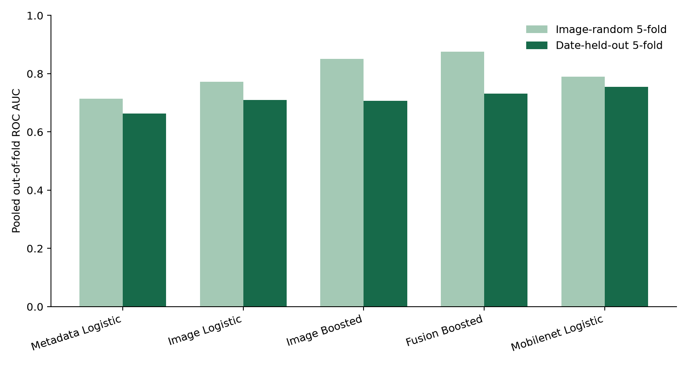
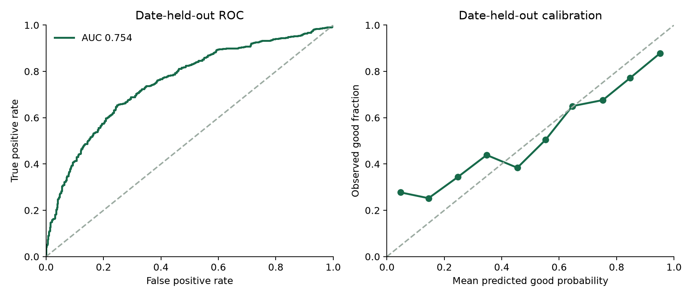

# ChipQC: batch-aware quality review for organ-on-a-chip microscopy

**AI4S category:** Tool & Platform. **Status:** research prototype; retrospective image-label validation only.

## Problem and proposed use

Organ-on-a-chip (OoC) experiments generate many brightfield frames. Expert sample-quality review can be time-consuming and may be inconsistent across acquisition sessions. ChipQC estimates whether a frame would receive the source dataset's expert *good* rather than *bad* image-quality label, and presents a manual-review prompt with simple image diagnostics. A scientist retains the decision. ChipQC does not measure drug efficacy, tissue function, or clinical safety.

## Data and provenance

We use a deterministic image-ID-hash sample of **1,200** of the 3,072 images in [Movčana et al.'s OOC Image Dataset](https://doi.org/10.5281/zenodo.10203721) (CC BY 4.0). The complete source has 1,727 good and 1,345 bad labels, six cell types, and partial culture metadata. Our sample spans **59** acquisition-date prefixes. Raw images and the metadata spreadsheet are fetched from the cited source and are not redistributed here. There are no patient images in this source dataset.

The supplied archive contains source train/test folders. We combine them for a new five-fold study because the scientific question here is performance on unseen acquisition dates. The date prefix in `imageID` is a grouping proxy; chip identity and laboratory identity were unavailable. Repeated views of a chip across dates could still be related.

## System and methods

The ingestion script reads the source ZIP by HTTP byte range and verifies archive/member sizes. Each frame is measured globally and in a central crop: brightness distribution, Laplacian focus proxy, gradient and edge content, texture co-occurrence, orientation, and spatial-frequency energy. A second feature route uses a frozen ImageNet-pretrained MobileNetV3 Small encoder on the same two views, then PCA to 64 components and regularized logistic regression. We compare image logistic regression, histogram gradient boosting, a metadata-only logistic reference, and an image-plus-metadata boosted model. Missing numeric metadata is imputed within each training fold. No label information is used in feature extraction or outside-fold fitting.

We evaluate each candidate twice: five-fold stratified image-random validation and five-fold stratified **acquisition-date-held-out** validation. All frames from one date prefix remain in one fold. The grouped estimate is the primary result. We report pooled out-of-fold (OOF) ROC AUC, average precision (AP), balanced accuracy at 0.5, and Brier score. The confidence interval resamples acquisition dates, retaining all images within a sampled date. We select the image-dependent model with the highest grouped OOF ROC AUC, then refit it on the full sampled dataset for the demo. This model selection uses the same folds and may make its reported result optimistic; an independent laboratory test is still needed.

## Retrospective results

| Model | Random AUC | Date-held-out AUC | Date AP | Date balanced accuracy | Date Brier |
|---|---:|---:|---:|---:|---:|
| Metadata Logistic | 0.713 | 0.663 | 0.684 | 0.589 | 0.232 |
| Image Logistic | 0.772 | 0.710 | 0.706 | 0.676 | 0.219 |
| Image Boosted | 0.850 | 0.707 | 0.707 | 0.652 | 0.232 |
| Fusion Boosted | 0.875 | 0.732 | 0.729 | 0.671 | 0.219 |
| Mobilenet Logistic | 0.790 | 0.754 | 0.791 | 0.694 | 0.210 |

The selected model is **mobilenet logistic**. Its grouped AUC is **0.754** (date-bootstrap 95% interval **0.690–0.808**), versus **0.790** with image-random folds. The gap is evidence that random validation is optimistic for acquisition shifts in this sample, though these are different fold assignments and the gap is not a causal effect estimate.

At illustrative review thresholds of 0.2 and 0.8, **48.2%** of OOF images fall outside the manual-review band; balanced accuracy on that subset is **0.785**. These thresholds were not prospectively calibrated and must not be interpreted as guaranteed error bounds.

### Breakdown by cell type

| Cell type | Images | Good share | Date-held-out AUC | Balanced accuracy |
|---|---:|---:|---:|---:|
| A549 | 297 | 0.690 | 0.722 | 0.658 |
| CACO | 136 | 0.294 | 0.869 | 0.814 |
| HPMEC | 557 | 0.542 | 0.736 | 0.674 |
| HSAEC | 105 | 0.610 | 0.599 | 0.579 |
| HUVEC | 44 | 0.091 | 1.000 | 0.988 |
| NHBE | 61 | 0.754 | 0.717 | 0.648 |

Small cell-type subgroups have unstable estimates. The application also compares a new image with training-image appearance in a 12-component handcrafted-feature space. Its 95th-percentile, other-date nearest-neighbor distance is an exploratory novelty flag. It is **not** a validated out-of-distribution or safety detector.

## Reproducibility and use

The [README](../README.md) gives exact dependency versions and commands to download the deterministic sample, compute features, rerun both validation protocols, generate this report, and start the FastAPI demo. The saved OOF predictions in `grouped_oof_predictions.csv` permit direct metric checking. Code is MIT licensed; the source images and spreadsheet remain under the dataset's CC BY 4.0 license. The PyTorch pretrained weights are downloaded separately.

## Limits and next validation

The data come from one published OoC image collection. No new chip run, independent lab, hardware, donor, or downstream biological endpoint has been tested. The expert good/bad label may reflect different failure modes; a model score does not explain the reason. The next study should collect chip IDs, laboratories, instruments, and prospective expert review; hold out whole chips and sites; evaluate calibration and time saved at an agreed review sensitivity; and test ambiguous or poor-quality frames with human adjudication. Until then, this is a review aid, not an autonomous release gate.

## References

1. Movčana et al., [Organ-on-a-Chip (OOC) Image Dataset](https://doi.org/10.5281/zenodo.10203721), Zenodo, 2023. License: CC BY 4.0.
2. Movčana et al., [Organ-On-A-Chip Image Dataset](https://www.mdpi.com/2306-5729/9/2/28), *Data*, 2024.
3. George, R. m., and Kenry, [Supervised-Learning-Driven Interrogation of Organ-on-a-Chip Quality from Microscopy Images](https://pmc.ncbi.nlm.nih.gov/articles/PMC12745998/), *Chem Bio Eng*, 2025. Our contribution is the date-held-out evaluation and review workflow, not the first quality classifier on these images.
